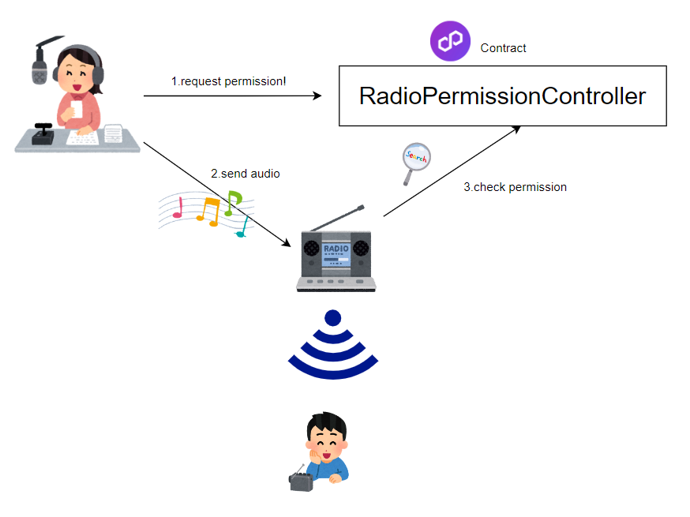

# World Radio

## What is WorldRadio?

WorldRadio is an FM radio station where people from all over the world can equally broadcast their own voice.

## Description

WorldRadio manages broadcasting rights through smart contracts. Therefore, anyone who meets the rules specified in the smart contract can acquire broadcasting rights. Additionally, users who acquire broadcasting rights can send encrypted audio data to their devices using end-to-end encryption (E2EE).

## How it works

This project consists of the following, which is composed of smart contracts and devices.

### Specifications

### Use Case 1: User creates an ECDH shared key

1. User generates their own ECDSA key.
1. User obtains the ECDSA public key from any contract.
1. User creates an ECDH shared key using their own ECDSA private key and the public key obtained in step 2.

### Use Case 2: User acquires authorization

1. User calls the startUserEngagement function of the contract and sends the ECDH shared key generated in Use Case 1, hashed with SHA-3.
1. User sends their own ECDSA public key to the device.
1. The device generates an ECDH shared key using the ECDSA public key received from the user and the device's own ECDSA private key.
1. The device confirms that the ECDH shared key received from the user matches the one generated by itself, hashes it with SHA-3, and writes it to the contract.

### Use Case 3: User sends voice data

1. User records their voice for 5 seconds with a microphone.
1. User plays back the recorded voice.
1. If playback is successful, the user compresses the voice data (in WAV format) in a way that can be compressed by Flutter and encrypts it using the ECDH shared key obtained in Use Case 1 with AES (using PKCS#7 padding and CBC mode).
1. User uploads the data encrypted in step 3 to any server.

### Use Case 4: Radio station play voice data

1. Radio station decodes the voice data received from the user.
1. The radio station saves the decoded data in WAV format.
1. The radio station broadcasts the data saved in step 2 using PyFM.

## Technical Stack

- [x] ECDH (Elliptic Curve Diffie-Hellman)
- [x] Flutter
- [x] Solidity
- [x] foundry
- [x] Polygon
- [x] Python
- [x] Flask
- [x] ffmpeg
- [x] shell script

## Deploy Contract

RadioPermissionController : https://mumbai.polygonscan.com/address/0x49477c47c9627a769c2374b59e436fc406509aca

https://twitter.com/polonity_eth/status/1647314927273779200?s=20

## Future

- [ ] PhysicalAsset's Keys should be created by the secure module.
- [ ] monitoring the broadcasting status
- [ ] realtime broadcasting(RTP/RTSP)
- [ ] support worldcoinID authentication

